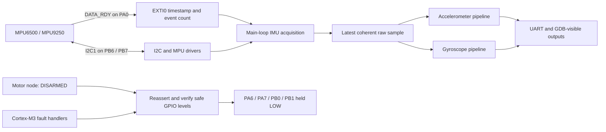
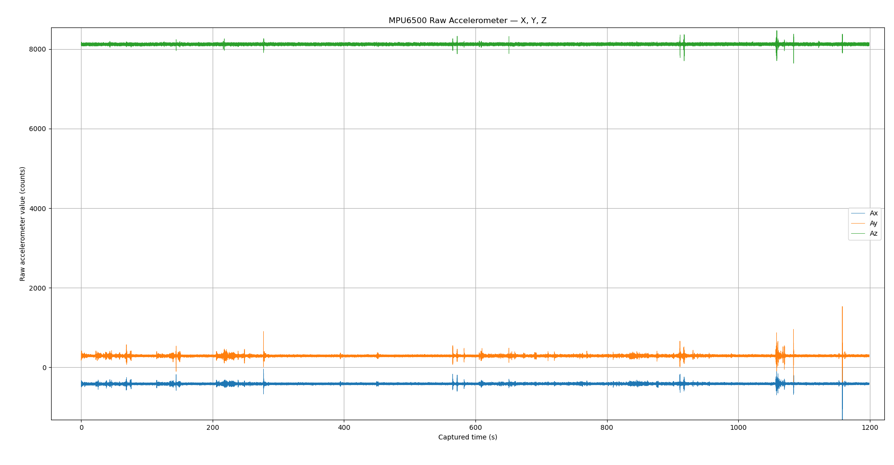

# Simple Drone

Simple Drone is a bare-metal quadcopter firmware project for the STM32F103C8T6. It is being built from the registers up—without an RTOS, STM32 HAL, or CMSIS dependency—to make sensor acquisition, timing, fault handling, and motor safety easy to inspect and test.

The repository currently contains two firmware targets:

- a **flight controller** that acquires MPU6500 or MPU9250 data at 500 Hz and can run calibrated accelerometer and gyroscope pipelines;
- a **motor node** that boots into a continuously enforced `DISARMED` state and holds all four motor outputs low.

It also includes host-side unit tests, UART data-capture and plotting tools, calibration notes, linker/startup code, and the initial directory structure for future Renode and Gazebo simulation.

> [!WARNING]
> This is development firmware, not a flight-ready autopilot. Motor PWM, arming, command transport, attitude estimation, sensor fusion, control loops, and PID control are not implemented. Keep propellers removed during development and testing.

## Highlights

- Direct-register STM32F103C8T6 drivers and startup code
- 72 MHz system clock from an 8 MHz external crystal
- 1 ms SysTick time base and wrap-safe 32-bit microsecond timestamps
- Bounded I2C transactions with diagnostics, retries, nine-clock bus clearing, and peripheral recovery
- Compile-time MPU6500/MPU9250 selection
- Interrupt-driven IMU data-ready signaling with I2C work kept out of the ISR
- Coherent accelerometer, temperature, and gyroscope reads at 500 Hz
- Optional AK8963 magnetometer acquisition for MPU9250 builds
- Measured MPU6500 accelerometer and gyroscope processing pipelines
- UART diagnostics and long-duration raw sensor capture modes
- Fail-safe motor GPIO handling and Cortex-M3 fault capture
- Native host tests for sensor decoding, sensor pipelines, and motor-node state logic

## Current architecture



The flight-controller ISR only records the latest edge timestamp and increments an event counter. Sensor reads, processing, and UART output happen in the main loop, keeping interrupt latency bounded. If multiple data-ready events accumulate, the acquisition layer reports overwritten events rather than pretending that every sensor state was read.

The motor node is deliberately conservative. Its only application state is currently `DISARMED`; every loop iteration reconfigures, drives, and verifies the four motor pins as low. Default, NMI, and HardFault paths request the same safe state before recording diagnostic information and stopping.

## Project status

| Area | Status |
|---|---|
| STM32 startup, linker scripts, clock, SysTick, microsecond timer, and UART | Implemented |
| MPU6500/MPU9250 motion acquisition | Implemented |
| MPU9250 AK8963 raw magnetometer acquisition | Implemented |
| I2C diagnostics and automatic recovery | Implemented |
| MPU6500 accelerometer calibration and filtering pipeline | Implemented |
| MPU6500 gyroscope bias and unit-conversion pipeline | Implemented |
| Long-duration accelerometer and gyroscope capture tools | Implemented |
| Motor-node fail-safe `DISARMED` state and fault handling | Implemented |
| Motor PWM, arming, and motor commands | Not implemented |
| Sensor fusion, attitude estimation, and PID control | Not implemented |
| CAN communication between nodes | Not implemented |
| Renode/Gazebo simulation | Directory and empty placeholder files only |

## Sensor processing

### Accelerometer

The optional accelerometer pipeline is calibrated for the measured MPU6500 in this repository. Each accepted sample passes through:

1. duplicate-sequence and near-saturation rejection;
2. an independent causal median-of-three filter on each axis;
3. measured six-face bias and counts-per-g correction;
4. an independent second-order 20 Hz Butterworth low-pass filter;
5. conversion from `g` to `m/s²` using standard gravity.

Rejected samples do not modify the median or Butterworth history. The implementation stores only the small rolling state required by the filters rather than retaining a time series in MCU RAM.

### Gyroscope

The optional gyroscope pipeline is also calibrated for the measured MPU6500. It provides:

- duplicate, sequence-gap, and saturation detection;
- fixed bias values derived from a stationary 20-minute capture;
- an optional startup calibration with 5 seconds of settling followed by 5 seconds of stationary collection;
- automatic calibration restart when the sample count is too low or motion/noise is excessive;
- bias-corrected output in raw counts, degrees per second, and radians per second;
- sample-interval reporting and a warning outside the expected 1.8–2.2 ms window.

## Hardware and pin assignments

The two firmware targets are intended for separate STM32F103C8T6 nodes.

| Function | Pin(s) | Used by |
|---|---|---|
| 8 MHz external crystal / 72 MHz system clock | Board oscillator | Both targets |
| I2C1 SCL / SDA | PB6 / PB7 | Flight controller |
| IMU `DATA_RDY` interrupt | PA0 | Flight controller |
| USART1 diagnostic TX | PA9 | Both targets |
| Motor outputs 1–4 | PA6, PA7, PB0, PB1 | Motor node |
| Active-low status LED | PC13 | Motor node |

The IMU driver uses address `0x68`. Its normal configuration is:

- motion sample rate: **500 Hz**;
- accelerometer: **±4 g**, approximately **41 Hz** device DLPF;
- gyroscope: **±500 °/s**, approximately **41 Hz** device DLPF;
- AK8963, when using an MPU9250: **100 Hz**, continuous 16-bit mode.

External I2C pull-up resistors and a 3.3 V-compatible USB-to-UART adapter are required as appropriate for the hardware.

## Prerequisites

Firmware builds require:

- GNU Make;
- the Arm GNU toolchain (`arm-none-eabi-gcc`, `objcopy`, `objdump`, `size`, and `nm`);
- an STM32 programmer/debugger such as ST-Link;
- OpenOCD or another compatible flashing tool.

Host tests require a C11 compiler such as GCC or Clang. Sensor capture and plotting use Python 3 with:

```bash
python3 -m pip install pyserial numpy pandas matplotlib
```

## Build the firmware

Run commands from the repository root.

### Flight controller

The default build targets the MPU9250 with both calibrated pipelines disabled:

```bash
make -C firmware/flight-controller
```

Build the current MPU6500 accelerometer and gyroscope pipelines together:

```bash
make -C firmware/flight-controller \
    IMU_MODEL=6500 \
    ACCEL_PIPELINE_ENABLE=1 \
    GYRO_PIPELINE_ENABLE=1
```

To calculate a fresh stationary gyroscope bias at startup and print processed gyro output at 10 Hz:

```bash
make -C firmware/flight-controller \
    IMU_MODEL=6500 \
    ACCEL_PIPELINE_ENABLE=1 \
    GYRO_PIPELINE_ENABLE=1 \
    GYRO_INITIAL_BIAS_CAL_ENABLE=1 \
    GYRO_PIPELINE_UART_DEBUG=1 \
    GYRO_PIPELINE_UART_RATE_HZ=10
```

The build produces:

```text
firmware/flight-controller/build/flight-controller.elf
firmware/flight-controller/build/flight-controller.bin
firmware/flight-controller/build/flight-controller.hex
firmware/flight-controller/build/flight-controller.map
```

The Makefile records feature values in `build/.build-config`, so changing a build option automatically rebuilds the affected objects.

### Motor node

```bash
make -C firmware/motor-node
```

The normal motor-node image only enters and enforces `DISARMED`. Controlled fault-test images are available with `FAULT_TEST_MODE=1`, `2`, or `3` for Default Handler, NMI, and HardFault testing respectively.

## Flashing

For example, flash the flight-controller ELF with an ST-Link and OpenOCD:

```bash
openocd \
    -f interface/stlink.cfg \
    -f target/stm32f1x.cfg \
    -c "program firmware/flight-controller/build/flight-controller.elf verify reset exit"
```

USART1 transmits diagnostics from PA9 at **115200 baud, 8-N-1**. The diagnostic driver is transmit-only.

## Useful flight-controller build options

| Option | Default | Purpose |
|---|---:|---|
| `IMU_MODEL` | `9250` | Select `6500` or `9250` |
| `I2C_BUS_HZ` | `400000` | Set the I2C1 bus frequency |
| `ACQ_UART_RAW_DEBUG` | `0` | Print periodic raw acquisition and I2C health data |
| `MPU_WHO_AM_I_TEST` | `0` | Probe addresses `0x68` and `0x69`, report identity, then halt |
| `IMU_INIT_DEBUG` | `0` | Print detailed IMU/I2C initialization failure diagnostics |
| `I2C_RECOVERY_TEST` | `0` | Enable the additional acquisition-level one-shot recovery experiment |
| `ACCEL_CAPTURE_TEST` | `0` | Capture and transmit 240 five-second raw accelerometer blocks |
| `GYRO_CAPTURE_TEST` | `0` | Capture and transmit 240 five-second raw gyroscope blocks |
| `ACCEL_PIPELINE_ENABLE` | `0` | Compile the MPU6500 accelerometer pipeline |
| `GYRO_PIPELINE_ENABLE` | `0` | Compile the MPU6500 gyroscope pipeline |
| `GYRO_INITIAL_BIAS_CAL_ENABLE` | `0` | Use stationary startup bias instead of fixed measured bias |
| `GYRO_PIPELINE_UART_DEBUG` | `0` | Print processed gyroscope values at a limited rate |
| `MEASURE_PIPELINE_TIMES` | `0` | Record accelerometer pipeline timing statistics for GDB |

Accelerometer debug output can independently include raw, median, calibrated-g, filtered-g, and filtered-m/s² triplets. See [`docs/accelerometer-pipeline.md`](docs/accelerometer-pipeline.md) for the corresponding build flags and memory notes.

> [!NOTE]
> `ACCEL_CAPTURE_TEST` and `GYRO_CAPTURE_TEST` are mutually exclusive. Capture modes own the main loop, and the calibrated pipeline constants require `IMU_MODEL=6500`.

## Run the host tests

The host tests exercise byte-order decoding, filter/calibration behavior, invalid-sample handling, timestamp wraparound, startup gyro calibration, and the motor-node fail-safe state machine.

```bash
make -C firmware/flight-controller test-host
make -C firmware/flight-controller test-accel-host
make -C firmware/flight-controller test-gyro-host
make -C firmware/motor-node test-state-host
```

These are native tests; they do not require an STM32 board.

## Capture and analyze sensor data

### Raw gyroscope capture

Build the dedicated MPU6500 capture image:

```bash
make -C firmware/flight-controller \
    IMU_MODEL=6500 \
    GYRO_CAPTURE_TEST=1 \
    ACCEL_CAPTURE_TEST=0 \
    ACCEL_PIPELINE_ENABLE=0 \
    GYRO_PIPELINE_ENABLE=0
```

Then capture and plot the UART stream:

```bash
cd py_scrypts
python3 gyro_uart_capture.py --port /dev/ttyUSB0 --output gyro_raw_20min.csv
python3 plot_gyro.py gyro_raw_20min.csv
```

The firmware stores five seconds of raw data in RAM, transmits the completed block, and reuses the buffer. The resulting dataset contains 20 minutes of actual samples; UART transfer gaps make the wall-clock experiment longer.

### Raw accelerometer capture

```bash
make -C firmware/flight-controller \
    IMU_MODEL=6500 \
    ACCEL_CAPTURE_TEST=1 \
    GYRO_CAPTURE_TEST=0 \
    ACCEL_PIPELINE_ENABLE=0 \
    GYRO_PIPELINE_ENABLE=0

cd py_scrypts
python3 accel_uart_capture.py
python3 plot_accel.py accel_raw_20min.csv
```

`accel_uart_capture.py` currently uses `/dev/ttyUSB0` and writes `accel_raw_20min.csv`; edit its configuration constants if your serial device differs.

### Processed accelerometer capture

Enable whichever accelerometer debug stages you want, then store the `[ACCEL PIPE]` messages in a structured CSV:

```bash
cd py_scrypts
python3 accel_pipeline_uart_capture.py \
    --port /dev/ttyUSB0 \
    --output accel_pipeline.csv
```

An example long-duration MPU6500 accelerometer capture is included in the repository:



## Repository layout

```text
Simple_drone/
├── docs/                         Calibration and sensor-pipeline notes
├── drivers/mpu9250/              MPU6500/MPU9250 and AK8963 driver
├── firmware/
│   ├── flight-controller/        Acquisition, pipelines, startup, tests, linker script
│   └── motor-node/               Fail-safe motor node, startup, tests, linker script
├── platform/stm32f103c8/         Clock, time, I2C, UART, and fault infrastructure
├── py_scrypts/                   UART capture, analysis scripts, and sample plots
├── simulation/                   Renode/Gazebo/bridge placeholders; not implemented yet
└── tests/                        Reserved top-level test directories
```

## Design notes

- The code is freestanding C11 and accesses STM32 registers directly.
- Both linker scripts target the STM32F103C8 memory map: 64 KiB Flash and 20 KiB SRAM.
- The microsecond clock extends the STM32F1 TIM2 16-bit counter in software and naturally wraps at 32 bits.
- The flight controller publishes completed sensor samples atomically and exposes acquisition/pipeline state as debugger-visible globals.
- Long-duration capture modes allocate a 15,600-byte RAM buffer only when compiled in.
- The simulation files and `docs/simulation-*.md` files are currently empty scaffolding and should not be treated as a working simulator.

## Further documentation

- [`docs/accelerometer-pipeline.md`](docs/accelerometer-pipeline.md) — accelerometer stages, debug flags, timing, memory use, and tests
- [`docs/gyro-stationary-capture.md`](docs/gyro-stationary-capture.md) — stationary gyroscope capture procedure and plotting workflow


